## 个人博客

### 技术实现

#### 1. 前端

- 使用 `vue.js` 框架和 `element-ui` 库完成

#### 2. 后端

- 使用 `go` 语言和 `echo` 框架完成
- 数据库使用 `mongodb` 完成

### 运行

#### 1. 后端

- 安装并启动`MongoDB`
- 配置`./backend/config/config.go`
  - `FilePath`: 后端服务器存放文章文件(markdown文件)的位置，需要绝对路径
  - `ImagePath`: 服务器存放图片文件的地址
  - `FrontImagePath`: 通过前端访问图片文件夹的地址
- 在`backend`文件夹下运行命令 `go run main/main.go`

#### 2. 前端

- 安装 `node.js` 环境
- 修改 `./frontend/api/api.js` line `4` & `5`  和 `./frontend/config/index.js` line `15` 为你go后端的地址
- 在`frontend`文件夹下运行命令 `npm run dev` 即可

### 功能介绍

#### 1. 注册登录

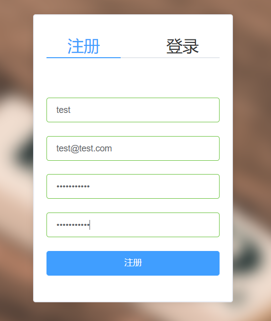

#### 2. 首页

- 首页会显示所有文章，使用分页机制来展示，每篇文章用一个卡片展示

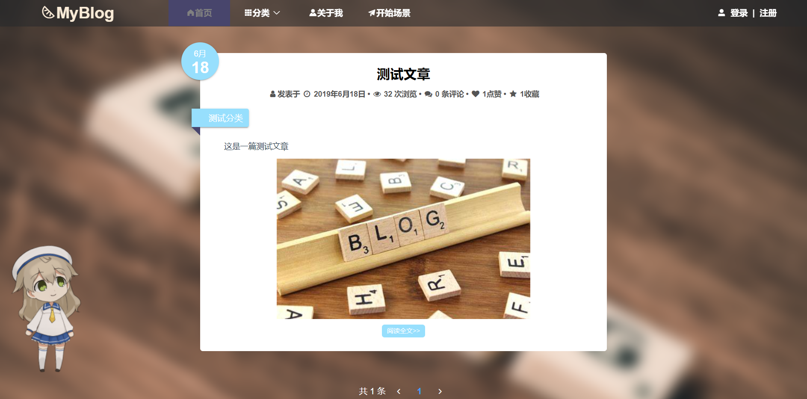

#### 3. 分类

- 使用分类机制来归档，每个分类分为两级

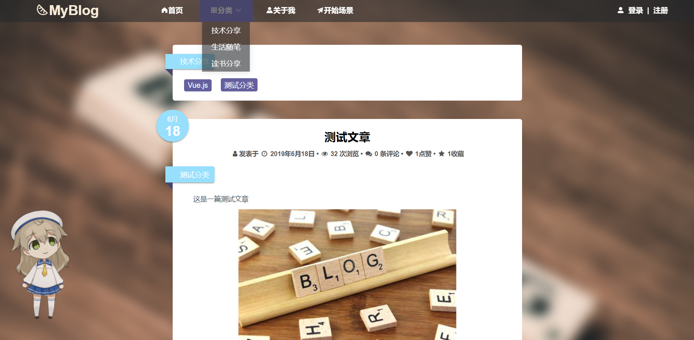

- 在分类页面可以点击二级分类来获取此二级分类的文章

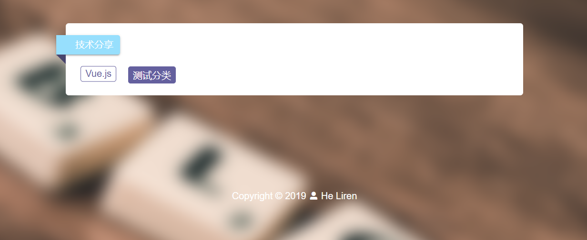

#### 4. 文章页面

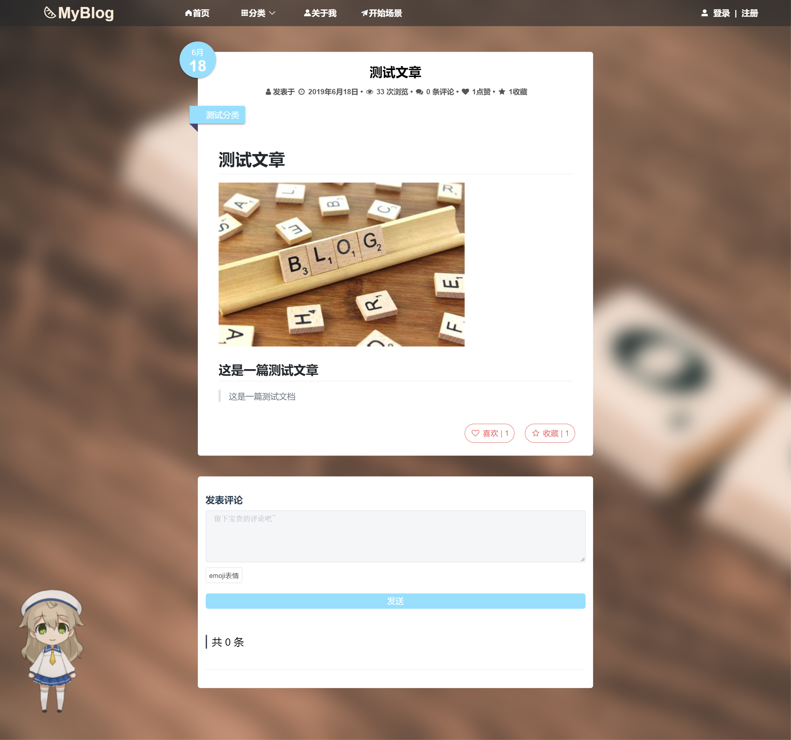

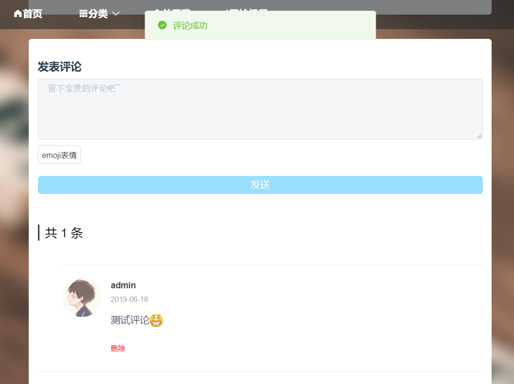

#### 5. 个人中心

- 个人中心界面可以看到基本信息

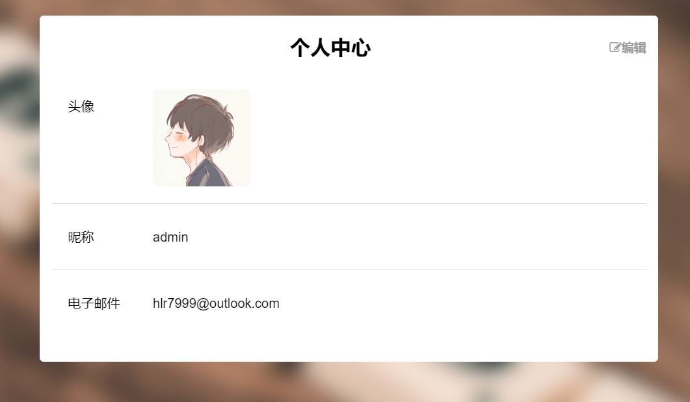

- 可编辑（可上传头像，修改用户名，但是修改用户名不能重名）

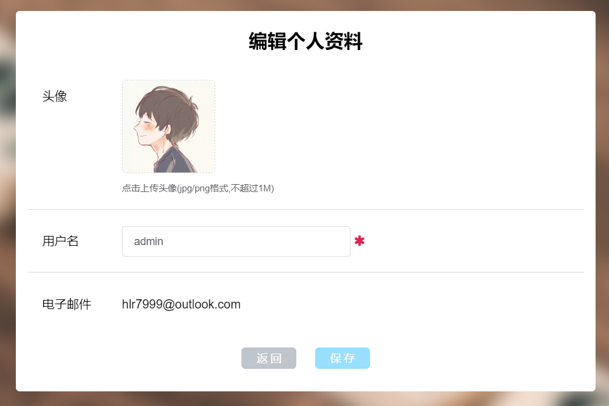

#### 6. 喜欢和收藏列表

- 喜欢和收藏列表展示喜欢和收藏的文章（截图展示收藏列表）

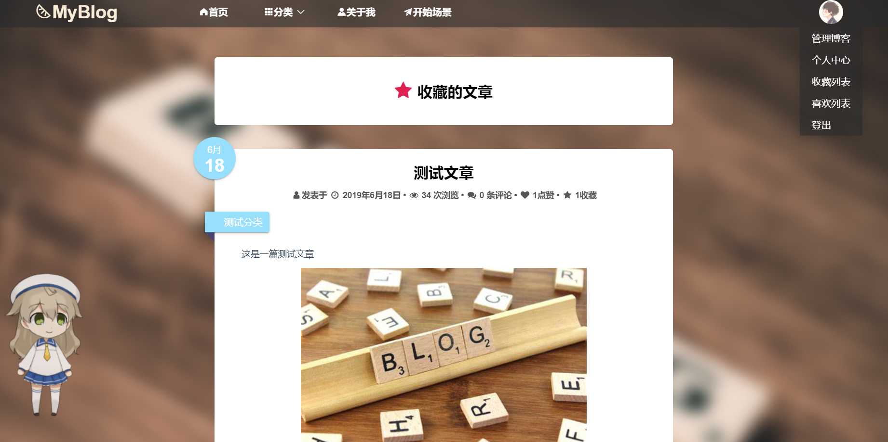

#### 7. 管理员管理博客

- 管理员可以管理博客
- 管理分为三个模块，文章管理，用户管理和分类管理

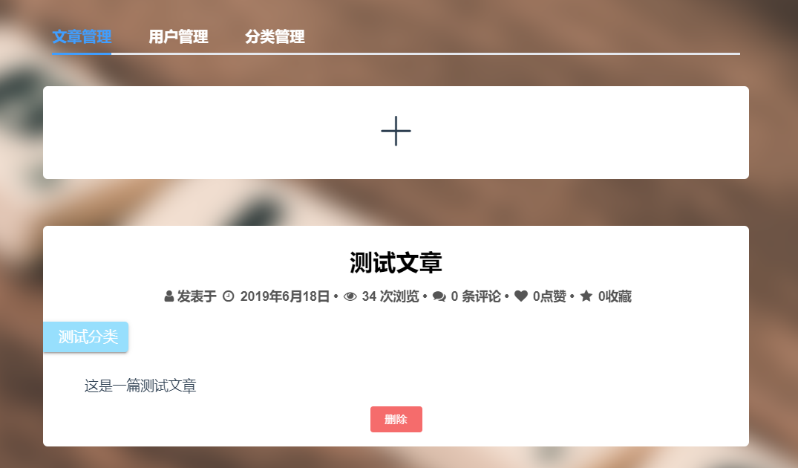

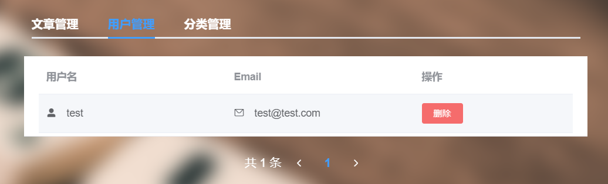

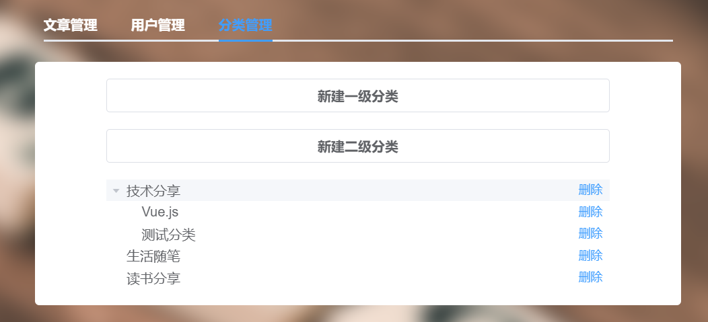

- 管理员写文章

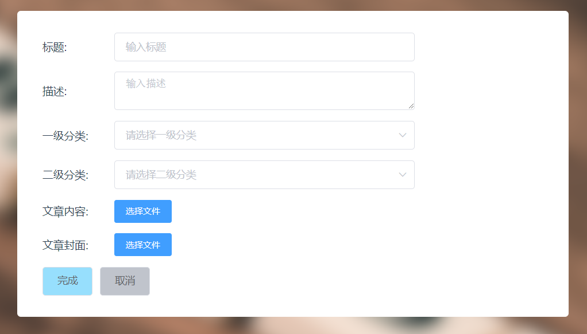

